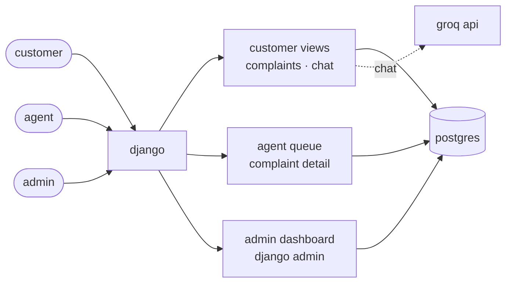
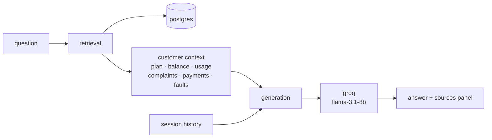

# telecom customer portal

> a customer portal for a trinidad telecom operator; covers the complaint management workflow and an ai chatbot that answers account questions from each customer's real data.


## overview

the portal has two core modules:

| module | what it does |
|---|---|
| **customer portal** | submit complaints, view history, chat about the account |
| **agent queue** | work assigned complaints, transition status, add notes |
| **admin dashboard** | stats by status and category, average resolution time, sla breach list |
| **ai chatbot** | natural language questions grounded in real account data, with source transparency |

data model with er diagrams: [`docs/schema.md`](docs/schema.md).

## architecture



three roles land on different views via a role-aware home redirect. all views share postgres. chat is the only path that also hits an external service.

## prerequisites

- docker 20+ with compose v2
- a groq api key from [console.groq.com](https://console.groq.com) (free tier)

no local python or postgres install required.

## quick start

**1. clone the repo**

```bash
git clone https://github.com/aidantrabs/telecom-customer-portal.git
cd telecom-customer-portal
```

**2. set up your environment**

```bash
cp .env.example .env
```

then edit `.env` and set `GROQ_API_KEY` (free tier from [console.groq.com](https://console.groq.com)).

**3. start the stack**

```bash
docker compose up --build
```

app available at [localhost:8000](http://localhost:8000).

> [!NOTE]
> first startup runs migrations and seeds sample data automatically. seed is idempotent, so `docker compose up` is safe to run repeatedly.

## seed data

the seed runs automatically on first startup. it creates:

- 3 service plans (basic, standard, premium) with data, call, and sms allowances
- 1 admin, 3 agents, 5 customers
- 15 complaints distributed across statuses, categories, and agents
- current-month usage records per customer
- 3 months of payment history per customer
- 2 network fault records (one active in port of spain, one resolved in san fernando)

the command exits with `database already seeded, skipping` when customer users exist, so every container start is safe. to force a full re-seed:

```bash
docker compose down -v
docker compose up --build
```

source: [`accounts/management/commands/seed.py`](accounts/management/commands/seed.py).

## credentials

| role | username | password | lands at |
|---|---|---|---|
| admin | `portal_admin` | `admin123` | `/dashboard/` |
| agent | `agent1` / `agent2` / `agent3` | `agent123` | `/agent/` |
| customer | `customer1` ... `customer5` | `customer123` | `/complaints/` |

root `/` redirects based on role after login.

## environment

| variable | purpose |
|---|---|
| `POSTGRES_DB` | database name |
| `POSTGRES_USER` | database username |
| `POSTGRES_PASSWORD` | database password |
| `DJANGO_SECRET_KEY` | any long random string |
| `GROQ_API_KEY` | groq api key for chatbot |
| `DEBUG` | `1` for development, `0` for production |

> [!IMPORTANT]
> `.env` is gitignored. a populated copy is attached separately as `env_config.txt` per submission instructions.

## chatbot

lives at `/chat/` for any logged-in customer.



- **model:** `llama-3.1-8b-instant` via groq
- **retrieval:** customer's full structured context fetched every turn
- **guardrails:** answers only from context, says "i don't have that information" otherwise
- **sources panel:** each response shows which data categories fed the answer
- **history:** per django session, cleared on logout or via the clear button

try asking:

- what plan am i on?
- how much data have i used this month?
- any outages in my area?
- when was my last payment?
- do i have any open complaints?

## design decisions

### architecture

- **custom user model with a `role` field** - extended `AbstractUser` with a `role` charfield using `TextChoices` rather than django groups. three fixed roles do not need a many-to-many table, and `user.role == 'agent'` reads cleaner than group lookups. django recommends defining a custom user model before the first migration since switching later is painful.
- **`resolved_at` set via `save()` override** - when a complaint transitions to `RESOLVED` or `CLOSED` for the first time, `resolved_at` is stamped inside `Complaint.save()`. keeps the admin dashboard's average resolution time accurate regardless of which view made the change.

### chatbot

- **full-context retrieval over keyword intent matching** - retrieval returns the customer's full structured context (~1kb) each turn rather than routing questions to specific fields. handles compound questions ("what's my plan and how much data have i used?") cleanly. absent data is explicit `null` or `[]` so the model sees the gap and says "i don't have that" instead of guessing.
- **category-level sources, not field-level citations** - each response surfaces which categories had data in context (plan, balance, usage, complaints, payments, faults). field-level citations would require llm structured output or tool calling, adding complexity without proportional value here.
- **session-scoped chat history** - stored in `request.session`, not a database model. spec calls for history "within a session". persisting chats via `Conversation` / `Message` models would help admin review but is out of scope.

### developer experience

- **auto-run on container startup** - `docker compose up --build` chains `migrate --noinput` → `seed` → `runserver`. seed is idempotent and bails on populated databases, so every startup is safe. zero manual steps for the reviewer.

## out of scope

custom auth flows. email or sms. payments processing. internationalization. websockets. comprehensive test suite.

## project layout

```
telecom-customer-portal/
├── accounts/
│   ├── management/commands/seed.py    sample data command
│   ├── models.py                      user, customer, plan, usage, payment, outage
│   ├── decorators.py                  role-based access decorators
│   └── signals.py                     auto-create customer on user save
├── complaints/
│   ├── models.py                      complaint + workflow
│   ├── views.py                       customer, agent, admin views
│   ├── forms.py                       customer and agent forms
│   └── {urls,agent_urls,dashboard_urls}.py
├── chat/
│   ├── retrieval.py                   build customer context
│   ├── generation.py                  groq client wrapper
│   └── views.py                       chat view + session history
├── config/                            django settings, root urls
├── templates/                         base, login, role-specific pages
└── docs/
    └── schema.md                      mermaid er diagrams
```

## development

| command | runs |
|---|---|
| `make up` | `docker compose up` |
| `make down` | `docker compose down` |
| `make build` | `docker compose up --build` |
| `make logs` | follow container logs |
| `make migrate` | apply migrations |
| `make makemigrations` | generate migrations |

> [!CAUTION]
> `docker compose down -v` wipes the postgres volume. next `up` re-migrates and re-seeds from scratch.
