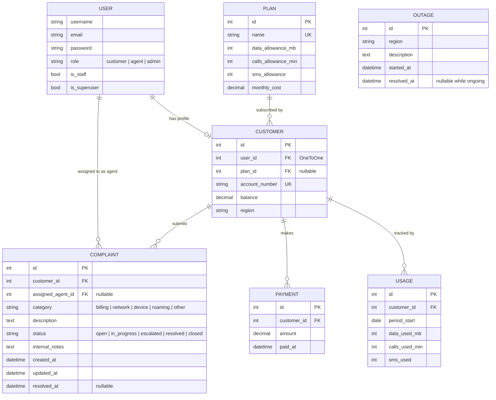

# data schema

all models are implemented and shown in a single er diagram below. the discussion section notes key design choices, and the module table maps models to the spec's two modules.

## er diagram

## decisions

- **custom user model with a `role` charfield** over django groups. three fixed roles do not need a many-to-many table. `user.role == 'agent'` is clearer than group lookups, and django recommends defining a custom user model before the first migration since switching later is painful.
- **customer is a separate profile model** rather than fields on user. keeps auth concerns and telecom-domain data decoupled.
- **`assigned_agent` is nullable with `SET_NULL`** so complaints survive when an agent leaves.
- **status and category as `TextChoices`** scoped to the `Complaint` model. `Complaint.Status.OPEN` reads cleanly everywhere.
- **`OUTAGE.region` as charfield**, not a separate region table. regions are few and stable; an extra table would not earn its weight.
- **`USAGE` has `unique_together` on `(customer, period_start)`** so there is exactly one row per billing period per customer.
- **`COMPLAINT.resolved_at` set via `save()` override** when status transitions to `RESOLVED` or `CLOSED` for the first time. keeps the admin dashboard's average resolution time accurate regardless of which view wrote the change.
- **no `Conversation` or `Message` tables** - chatbot history is session-scoped per the spec. persisting chats would help admin review but is out of scope.

## model usage by module

| module | models used |
|---|---|
| complaint management (customer, agent, admin) | User, Customer, Complaint |
| ai chatbot | User, Customer, Plan, Usage, Payment, Outage, Complaint |
